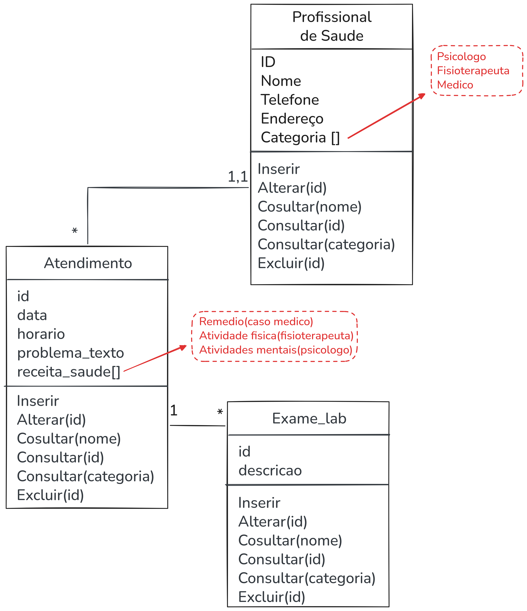

# Clínica Web - Material Educacional

Sistema de Clínica Web para demonstração do ciclo completo de desenvolvimento de software.

Disponível em: <a href="https://clinica-frontend-ir4e.onrender.com/">Link<a>

## Diagrama de Classe



## Tecnologias

| Camada | Tecnologia |
|--------|-----------|
| Backend | Java 17 + Spring Boot 3.2 |
| Frontend | React 18 + React Router |
| Banco de Dados | PostgreSQL 15 |
| Build Backend | Maven |
| Build Frontend | Node.js 20 + npm |
| Versionamento | Git + GitHub |
| CI/CD | GitHub Actions |
| Containers | Docker + Docker Compose |
| Produção | AWS (ECS + RDS + ECR + ALB) |

## Estrutura do Projeto

```
clinica-web/
├── backend/           # API REST (Java/Spring Boot)
│   ├── pom.xml
│   ├── Dockerfile
│   └── src/
├── frontend/          # UI (React)
│   ├── package.json
│   ├── Dockerfile
│   └── src/
├── docker-compose.yml
├── .github/workflows/ci-cd.yml
└── apresentacao_completa.html  # Apresentação da aula
```

## Como Executar (Desenvolvimento)

```bash
# Usando Docker Compose
docker-compose up -d

# Backend disponível em: http://localhost:8080
# Frontend disponível em: http://localhost:3000
```

## Como Executar Testes

```bash
# Backend (JUnit 5 + Mockito)
cd backend
mvn test

# Frontend (Jest)
cd frontend
npm test
```

## Divisão de Trabalho

- **DEV 1 - Davi Ferreira Puddo:** Backend, Frontend e Testes Unitários
- **DEV 2 - Diego Feitosa Ferreira dos Santos:** Teste de integração, Pipeline CI/CD e Deploy
